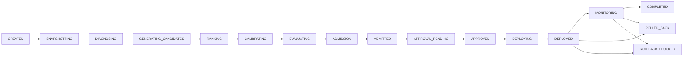

# 🧠🗄️ AI-Driven Autonomous NoSQL Query Optimization Framework

> An AI that's allowed to *look* at your MongoDB, form an opinion, argue that opinion in a sandboxed copy of your data — and only gets to actually touch production if it wins the argument with numbers, not vibes.

This isn't "ask an LLM to write you an index." It's a control plane that sits next to a live MongoDB, continuously diagnoses its query workload, proposes fixes, proves they work in isolation, and then walks the change through an audited, reversible pipeline before it's allowed anywhere near your real data. Think of the model as a very confident junior DBA who is never, ever handed the production credentials directly.

---

## 🧑‍🎓 The 5-minute crash course (start here if you're new to any of this)

**The problem, in plain English:** every query your app sends to MongoDB has to find matching documents somehow. Without help, the database checks *every single document* — a "collection scan." That's fine at 100 documents, brutal at 100 million.

Indexes are the solution. An index is like the index at the back of a textbook: instead of reading every page to find a topic, MongoDB can use the index to jump much closer to the documents it needs. But indexes aren't free. They consume memory and storage, and they add overhead to inserts and updates. Worse, the wrong index can provide little benefit while still imposing that cost. So the real challenge isn't simply "add an index" — it's understanding what queries the application actually runs, how frequently they run, and which index structures are worth maintaining for them.

**Why this is a real, ongoing headache:** query patterns drift as an app grows. Nobody sits down every week to re-audit every collection's indexes against real traffic. So databases quietly accumulate slow queries, redundant indexes, and missed opportunities — and most teams only notice when something's already on fire in production.

**What this project actually does about it:**
1. Watches your real query traffic and figures out which query shapes are slow or expensive (the **diagnosis**).
2. Mechanically works out which indexes would help, using well-established rules — no guessing (the **candidates**).
3. Actually tests those candidates against a sandboxed copy of your real data, measuring the real before/after impact, instead of assuming (the **evaluation**).
4. Only proposes a change once it's *measurably* better — and requires it to prove that again if anything changes before you hit approve (the **admission + approval**).
5. Ships the change through a fully logged, reversible pipeline, so if something ever does go sideways, there's a one-click undo and a paper trail explaining exactly what happened and why (the **deployment + ledger**).

In short: it automates the "notice → diagnose → propose → test → ship safely" loop that a good DBA does by hand, using an LLM for the "notice/propose" creative part and hard, deterministic engineering for every part where being wrong would actually cost you something.

---

## 🎭 The pitch, minus the marketing

Every optimization travels down the same fixed 17-stage rail, every single time:


*(Any stage can also drop straight to `FAILED` — omitted above to keep it readable.)*

The AI gets a say at exactly two of those stages — `DIAGNOSING` and `RANKING`. It doesn't get a vote on whether a candidate is *allowed to exist*, whether it *actually helped*, or whether it's *safe to ship*. That's all deterministic code with no vibes to appeal to.

---

## 🔬 What's actually going on under the hood

- **Snapshot first, opinions second.** A run starts by freezing the target's real query shapes and index stats into an immutable snapshot, turned into an evidence bundle with hashable IDs (`evidence_ref`, `query_shape_id`, `SNAPSHOT:<id>`). That's the *only* thing the model is allowed to cite.

- **Diagnosis on a short leash.** The evidence goes to a local model (this project is built around Ollama — nothing leaves the host). The system prompt is not subtle about it: *"If you cannot cite exact supplied IDs, return an empty findings list. Do not invent metric values, query-shape IDs, evidence references, findings, MongoDB commands, or executable actions."* No citation, no finding.

- **Candidates come from math, not imagination.** Index candidates are produced by a deterministic generator (`DeterministicIndexGenerator`) applying the classic Equality → Sort → Range pattern to a query shape's fields, yielding a typed, hash-identified `CreateIndexAction` — never a raw string the model could smuggle a command into. The LLM's downstream job is narrower still: rank *opaque handles* it's handed. It can't rename them, invent new ones, or drop any ("Handles are not database identities and do not define or modify candidates.").

- **Experience memory nudges the order.** A lightweight learned prior re-sorts candidates toward patterns that have empirically worked before, sitting in front of the LLM call rather than inside it.

- **Everything gets benchmarked in a sandbox, never in prod.** Surviving candidates run against an isolated evaluation copy of the data under one of three frozen statistical profiles (`SMOKE`, `AUTONOMOUS`, `PUBLICATION`), each with its own warm-up time, sample-size floor, and confidence requirement.

- **Admission is arithmetic.** A frozen JSON policy defines per-metric directions, improvement caps, and "zero-tolerance invariants" — metrics that are never allowed to regress, no matter how good everything else looks. A candidate is admitted only if the *measured* improvement clears a configured threshold.

- **Approval is glued to the evidence, not the action.** Every human approval is bound to a specific `evidence_hash`. If the underlying diagnosis changes after someone approves it, the approval goes `STALE` and can't be reused. It also expires (15 minutes by default) — no rubber-stamping something from last week.

- **"Full autonomous" is a narrow exception, not a master switch.** It waives human approval only for two low-blast-radius action types (`CREATE_INDEX`, a query-settings index hint) — and even those can be force-gated back to human review with a flag that always wins.

- **Every real write gets chained into a ledger.** SHA-256 hash-chained entries capture before/after state, the forward action *and* its inverse, and the evidence hash — a tamper-evident history where every change already carries its own undo button.

- **Rollback is an outcome, not a hope.** Deployed changes can transition to `ROLLED_BACK` — or honestly to `ROLLBACK_BLOCKED` when a safe reversal can't be guaranteed, instead of quietly pretending everything's fine.

---

## 🏗️ Architecture, the 30-second version

| Layer | Tech | Job |
|---|---|---|
| **Control-plane API** | FastAPI + PostgreSQL (async SQLAlchemy, Alembic) | Source of truth for runs, approvals, the ledger, auth |
| **Worker** | Async Python | Actually runs the diagnosis→admission→deploy pipeline |
| **Target datastore** | MongoDB replica set | What's being optimized — touched only through a typed adapter, never a shell command |
| **AI provider** | Ollama (`gemma4:e4b` chat + `embeddinggemma` embeddings, both swappable) | Diagnosis and ranking, always evidence-grounded |
| **Frontend** | React + TypeScript + Vite + Tailwind | Dashboards for runs, targets, workloads, approvals |
| **Glue** | Docker Compose profiles (`light`, `replica-test`, `paper`) | Reproducible environments |

The safety story isn't just prompt-level pleading — `app/adapters/contracts.py` defines the *entire* set of operations orchestration code can perform against the target: list namespaces, list indexes, a typed `IndexSpec`, a typed query-settings hint. There is no code path from "the model said so" to "arbitrary command runs on your cluster."

---

## 🗂️ Repo layout, skimmed

```
backend/app/
  state_machine/    ← the frozen 17-state lifecycle
  pipeline/         ← snapshot → evidence → candidates → AI → sandbox → admission
  candidates/        ← deterministic ESR index generation
  ai/               ← Ollama provider + the two locked-down prompts
  admission/         ← statistical profiles + zero-tolerance metric policy
  approvals/         ← evidence-bound, expiring approval flow
  autonomy/          ← the narrow full-autonomous bypass rule
  ledger/            ← hash-chained production action log
  rollback/          ← inverse-action rollback machinery
  adapters/          ← the typed MongoDB adapter (+ fakes for tests)
  monitoring/        ← post-deployment health + workload-shift detection
frontend/src/        ← runs / targets / workloads / expert dashboards
docs/                ← RUNBOOK, THREAT_MODEL, SAFETY_CONTRACT, audits
scripts/              ← bootstrap, demo mode, acceptance automation
```

---

## 🚀 Getting it running

Prereqs: Docker, Python 3.12, and [Ollama](https://ollama.com) running locally, with these two models pulled:

```bash
ollama pull gemma4:e4b          # chat model — does diagnosis + ranking
ollama pull embeddinggemma       # embedding model — powers the experience-memory lookup
```

These are the defaults (`gemma4:e4b` / `embeddinggemma`), wired in via `OLLAMA_CHAT_MODEL` and `OLLAMA_EMBEDDING_MODEL`. Want to use different models? Two things to know first:

- **Swapping the chat model is easy** — just set `OLLAMA_CHAT_MODEL` in `.env` to any model you've pulled (`ollama pull <name>`). No code changes needed.
- **Swapping the embedding model needs a matching vector size.** The experience-memory store is hardcoded to 768-dimensional vectors (`EMBEDDING_DIMENSIONS = 768` in `backend/app/experience/memory.py`, and the pgvector column in `backend/app/db/models.py`). `embeddinggemma` happens to output 768 dims. If you switch to a model with a different output size, you'll need to update `EMBEDDING_DIMENSIONS` and the `Vector(768)` column definition (plus a matching Alembic migration) to match, or the embedding calls will fail validation.

```bash
# in .env
OLLAMA_CHAT_MODEL=your-model-name
OLLAMA_EMBEDDING_MODEL=your-embedding-model-name   # only if it's also 768-dim
```

**Intel Mac**
```bash
./scripts/bootstrap.sh
source nosql/bin/activate
cp .env.example .env
mkdir -p .secrets
python3 scripts/generate_master_key.py --output .secrets/control_plane_master_key
python3 scripts/generate_mongodb_keyfile.py --output .secrets/mongodb_replica_keyfile
make dev
```

**Apple Silicon Mac / Linux**
```bash
cp .env.example .env
mkdir -p .secrets
python3 scripts/generate_master_key.py --output .secrets/control_plane_master_key
python3 scripts/generate_mongodb_keyfile.py --output .secrets/mongodb_replica_keyfile
docker compose --profile light up -d
```

**Windows**
```bash
wsl --install          # then run everything below inside that Ubuntu shell
cp .env.example .env
mkdir -p .secrets
python3 scripts/generate_master_key.py --output .secrets/control_plane_master_key
python3 scripts/generate_mongodb_keyfile.py --output .secrets/mongodb_replica_keyfile
docker compose --profile light up -d
```

That brings up the API, worker, Postgres, two Mongo targets, and the frontend at `http://localhost:5173`.

### Take it for a spin

```bash
make demo-reset
make demo-start
make demo-seed
make demo-workload
```
Then open the frontend and watch a run move through the lifecycle live.

### Or drive it from the API directly

```bash
curl -X POST http://localhost:8000/auth/login -d '{"username": "...", "password": "..."}'
curl -X POST http://localhost:8000/targets -H "Authorization: Bearer $TOKEN" -d '{ ... }'
curl -X POST http://localhost:8000/runs -H "Authorization: Bearer $TOKEN" -d '{ "target_id": "..." }'
curl http://localhost:8000/runs/{run_id} -H "Authorization: Bearer $TOKEN"
curl -X POST http://localhost:8000/approvals/{approval_id}/approve -H "Authorization: Bearer $TOKEN"
```

### Run the tests

```bash
make test
make acceptance
```

Before pointing this at a real production MongoDB, read `docs/RUNBOOK.md`.

---

## 🛡️ The one-sentence version of why it's built this way

Language models are great at hypotheses and bad at being trusted with side effects — so this one never touches the database, never emits a raw command, and never gets the last word. It proposes; deterministic code and measured evidence dispose.
